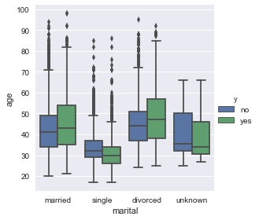
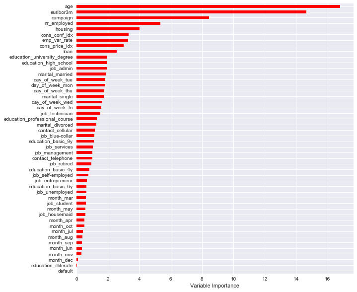

# Term Deposit Classification Project

## Campaign

Financial Institution - We are having a campaign. We want people to subscribe to a term deposit. We have been recording our success rate on clients for a while. Can you tell us who we can convert based on their financial data?
We have their age, job, employees, their loans, if they have any credit defaults, when we called them, their education, etc., and we also recorded if our call was successful or not. What can we learn? What would be useful for us?

## Data

## Basic Demographics of roughly 48,000 individuals

1. age (numeric)
2. job : type of job (categorical: 'admin.','blue-collar','entrepreneur','housemaid','management','retired','self-employed','services','student','technician','unemployed','unknown')
3. marital : marital status (categorical: 'divorced','married','single','unknown'; note: 'divorced' means divorced or widowed)
4. education (categorical: 'basic.4y','basic.6y','basic.9y','high.school','illiterate','professional.course','university.degree','unknown')
5. default: has credit in default? (categorical: 'no','yes','unknown')
6. housing: has housing loan? (categorical: 'no','yes','unknown')
7. loan: has personal loan? (categorical: 'no','yes','unknown')

## Related with the last contact of the current campaign:
8. contact: contact communication type (categorical: 'cellular','telephone')
9. month: last contact month of year (categorical: 'jan', 'feb', 'mar', ..., 'nov', 'dec')
10. day_of_week: last contact day of the week (categorical: 'mon','tue','wed','thu','fri')
11. duration: last contact duration, in seconds (numeric). Important note: this attribute highly affects the output target (e.g., if duration=0 then y='no'). Yet, the duration is not known before a call is performed. Also, after the end of the call y is obviously known. Thus, this input should only be included for benchmark purposes and should be discarded if the intention is to have a realistic predictive model.

## Other Attributes:
12. campaign: number of contacts performed during this campaign and for this client (numeric, includes last contact)
13. pdays: number of days that passed by after the client was last contacted from a previous campaign (numeric; 999 means client was not previously contacted)
14. previous: number of contacts performed before this campaign and for this client (numeric)
15. poutcome: outcome of the previous marketing campaign (categorical: 'failure','nonexistent','success')

## Social and Economic Context Attributes
16. emp.var.rate: employment variation rate - quarterly indicator (numeric)
17. cons.price.idx: consumer price index - monthly indicator (numeric)
18. cons.conf.idx: consumer confidence index - monthly indicator (numeric)
19. euribor3m: euribor 3 month rate - daily indicator (numeric)
20. nr.employed: number of employees - quarterly indicator (numeric)

## Output Variable (Desired Target):
21. y: has the client subscribed a term deposit? (binary: 'yes','no')

## EDA

**Pairplot of Numeric Data**

I ran a pairplot on various numeric data. There was some noticeable correlations between features form the pairplot, but ultimately decided to check using a correlation matrix/heatmap. There were some slightly positive correlations and other were negative. I fit a regression line to show this.

**Correlation Heatmap**

There were very high correlations between emp.var.rate, cons.price.idx, euribor3m, and nr.employed. This could entail performing dimensionality reduction.

**Factor Plot**

I performed a factor plot to show that there were not large differences among marital status types, which could have affected the subscription outcome. Age could be an important feature, but we would have to confirm this through the specific models.

**Violin Plot**

The violion plot shows there is not much difference between the distributions of yes/no subscriptions between the educations other than the basic 4 year education, which has a higher mean age for successful subscriptions. Again, this could be an important feature to be tested.

**Bar Plot**

The bar plot shows that the previous number of contacts on average was higher for those who successfully subscribed.

## Data Manipulation

1) Convert categorical variables to numerical/dummies
2) Drop unknown variables
3) According to the UCI data, we could remove variables that influenced the outcome immensely such as poutcome, pdays, previous and duration.

## Approach to Prediction

The first two classifiers that came into mind were Random Forest Classification (RFC) and Decision Tree Classification (DTC), both tree-based methods.

**Decision Tree**

Given that RFC usually provides better results because of its robustness and consistency, we would expect this to be the case. However, this was not true. DTC with the default parameters ran at an 81.9% accuracy rate (see below).

After adjust the max_depth parameter to 1, DTC's accuracy dramatically improved to 87.4%.

Then, to implement a more robust way optimizing parameter tuning, I used Grid Search to take in different max_depth and max_features paramaters as well as splitter and criterion.

The additional parameter tuning of splitter and criterion actually dropped the accuracy of DTC from 87.9% to 87.7%.

**Random Forest**

I ran Grid Search on RFC and obtained a best accuracy score of 87.6%, which is surprisingly lower than DTC, but only slightly.

**Feature Importance**

- The employment variation rate was the most important feature in the DTC model by a wide margin.

- Age and euribor3m were the top two important features in RFC.

## Gradient Boosting

I ran gradient boosting through the grid search parameter tuning and obtained an accuracy score of 87.8%.

Additionally, euribor3m and nr_employed were the top two important features (close in importance).

## Logistic regression

The last classification technique I chose to use was Logistic Regression. Surprisingly, it delivered the highest accuracy rate of 88.0%. This could imply that a single decision boundary is needed and nothing more for this specific dataset.

## Further Research
1) Improve on the EDA with more insightful charts.
2) Could use PCA to reduce the number of dimensions because some features are highly correlated.
3) Additional gridsearch parameter tuning to get closer or above 90% accuracy score.
4) Perform more analysis/parameter tuning for logistic regression.
